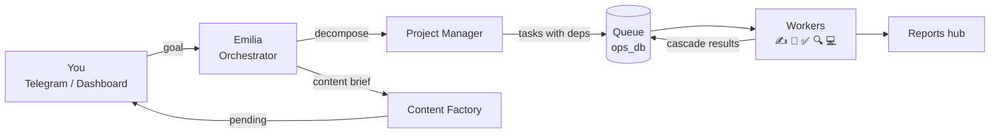

### Denis Kolesnikov

I'm building [Amori](https://amori.online) — a GPS pet-collar startup — and I run it with a
personal AI agent team I wrote from scratch.

The team is 9 Python agents running 24/7 on a Mac Mini: an orchestrator that takes goals on
Telegram, a project manager that breaks them into tasks, specialized workers (copywriter, designer,
reviewer, researcher, dev), and a set of ops agents handling email, CRM, calendar, knowledge curation
and infrastructure monitoring. I approve what ships. They do the rest.

I built the product end-to-end too: 8 Go microservices, a Kotlin Android app that talks to the collar
over BLE, two React 19 frontends (landing + shop), and a Kafka telemetry pipeline that converts raw
accelerometer batches into activity and heart-rate estimates per minute.

---

#### What I'm working on now

```
├── amori.online             — GPS pet-collar platform (commercial · private)
│   ├── 8 Go 1.26 microservices  (Gin · Kafka · Keycloak RS256 JWT)
│   ├── Kotlin Android           (BLE · Room · Hilt · Jetpack Compose)
│   └── React 19 + Vite          (landing + shop)
│
└── agent-os ↓               — the AI team that operates the startup (open source)
    ├── 9 Python agents          (Groq LLaMA 3.3 70B · Ollama · launchd)
    ├── FastMCP server           (11 tools → Claude Code / Codex / Hermes)
    └── Pixel office :5070       (React+Canvas · agents light up on activity)
```

👉 **[agent-os](https://github.com/Lenis45/agent-os)** — fully open source

---

#### How a task moves through the team



Reviewer gets the copywriter's text via a recursive CTE — no context gaps between dependent tasks.

---

#### Stack

**Amori (product)**


**agent-os (AI team)**


---

#### Earlier work

Before Amori: built React Native mobile apps, 3D portfolio sites in Three.js, a full-stack
online store (React + Node.js + PostgreSQL), and a live chat app. Started with React, moved
to building real products — the stack got more serious as the problems did.

---

<div align="center">


</div>
