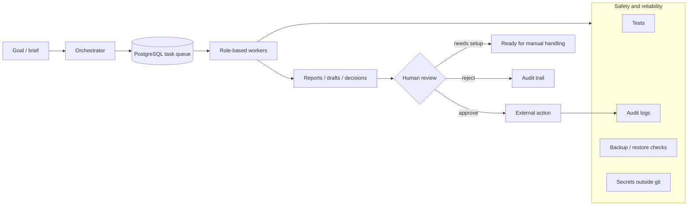

# Denis Kolesnikov / Lenis45

**AI Systems Engineer · Product Automation · Full-Stack Builder**

---

## Employer Snapshot

<table>
  <tr>
    <td width="50%">
      <h3>What I Do</h3>
      

        I design and build AI-powered product systems: agent workflows, local automation,
        dashboards, data boundaries, and human-in-the-loop tools that help real teams move faster.
      

    </td>
    <td width="50%">
      <h3>Where I Fit</h3>
      

        AI Engineer, Backend/Product Engineer, Automation Architect, or Full-Stack Engineer on teams
        building internal tools, AI workflows, operational platforms, or early-stage products.
      

    </td>
  </tr>
  <tr>
    <td width="50%">
      <h3>Current Focus</h3>
      

        Building <b>Amori</b>, a pet-tech GPS collar product, and the supporting AI operating
        system that helps run founder operations, SMM, support, CRM, and knowledge workflows.
      

    </td>
    <td width="50%">
      <h3>Engineering Style</h3>
      

        I prefer working systems over demos: tests, audit trails, clear failure states, safe secrets,
        documented architecture, and product interfaces a non-engineer can actually use.
      

    </td>
  </tr>
</table>

---

## Selected Work

<table>
  <tr>
    <td width="33%">
      <h3><a href="https://github.com/Lenis45/agent-os">agent-os</a></h3>
      

        Local AI operating system for Amori: agents, PostgreSQL task queue, dashboard,
        Telegram operator UI, MCP bridge, backups, restore checks, and safety contracts.
      

      

        
        
      

    </td>
    <td width="33%">
      <h3><a href="https://github.com/Lenis45/amori-smm-platform">amori-smm-platform</a></h3>
      

        Public architecture and product overview for SMM automation: brief to branded post,
        visual, review, calendar, approval, and Telegram delivery.
      

      

        
        
      

    </td>
    <td width="33%">
      <h3><a href="https://github.com/Lenis45/lenis45.github.io">portfolio</a></h3>
      

        Personal portfolio and frontend presentation work. I use it to show product polish,
        interaction design, and public-facing communication.
      

      

        
        
      

    </td>
  </tr>
  <tr>
    <td width="33%">
      <h3><a href="https://github.com/Lenis45/online-store">online-store</a></h3>
      

        Full-stack store project with React, Node/Express, PostgreSQL, authentication and
        product/order flows.
      

      

        
        
        
      

    </td>
    <td width="33%">
      <h3><a href="https://github.com/Lenis45/3d_portfolio">3d_portfolio</a></h3>
      

        Interactive 3D portfolio experiment built with React and Three.js, focused on visual
        presentation and motion.
      

      

        
        
      

    </td>
    <td width="33%">
      <h3><a href="https://github.com/Lenis45/ai-devkit">ai-devkit</a></h3>
      

        Public AI/dev tooling experiments and small utilities around AI-assisted engineering.
      

      

        
        
      

    </td>
  </tr>
</table>

---

## System Design Example

This is the pattern I keep applying: AI is useful when it is wrapped in
state, permissions, review, observability, and recovery. The model call is only
one part of the product.

---

## Skills Matrix

| Category | Strengths |
|---|---|
| AI systems | Agent workflows, prompt contracts, tool use, HITL, model fallback, MCP tools |
| Backend | Python, FastAPI, PostgreSQL, queues, service boundaries, diagnostics |
| Product automation | SMM workflow, CRM/lead flows, support workflows, calendar/email operations |
| Frontend | React, TypeScript, dashboard UX, responsive interfaces, Three.js experiments |
| Operations | Docker Compose, macOS launchd, backups, restore tests, support bundles |
| Security mindset | No secrets in git, role boundaries, audit trails, fail-closed behavior |

---

## What Employers Can Evaluate Quickly

| Signal | Where to look |
|---|---|
| System architecture and documentation | [agent-os README](https://github.com/Lenis45/agent-os) |
| AI workflow product thinking | [amori-smm-platform](https://github.com/Lenis45/amori-smm-platform) |
| Frontend/product presentation | [lenis45.github.io](https://github.com/Lenis45/lenis45.github.io), [3d_portfolio](https://github.com/Lenis45/3d_portfolio) |
| Full-stack fundamentals | [online-store](https://github.com/Lenis45/online-store) |
| Current product context | Amori private/commercial work, represented through public architecture repos |

---

## Current Priorities

| Priority | Work |
|---|---|
| P0 | Build Amori SMM automation into a usable product workspace |
| P0 | Keep `agent-os` truthful, tested, recoverable, and safe to operate |
| P1 | Improve UX for non-engineering users: editorial studio, calendar, visuals, automation rules |
| P1 | Publish clean public architecture notes without leaking commercial code or secrets |
| P2 | Turn reusable patterns into small tools and public examples |

---

## Contact

---

## Activity And Graphs

 

