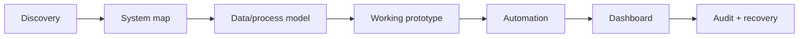
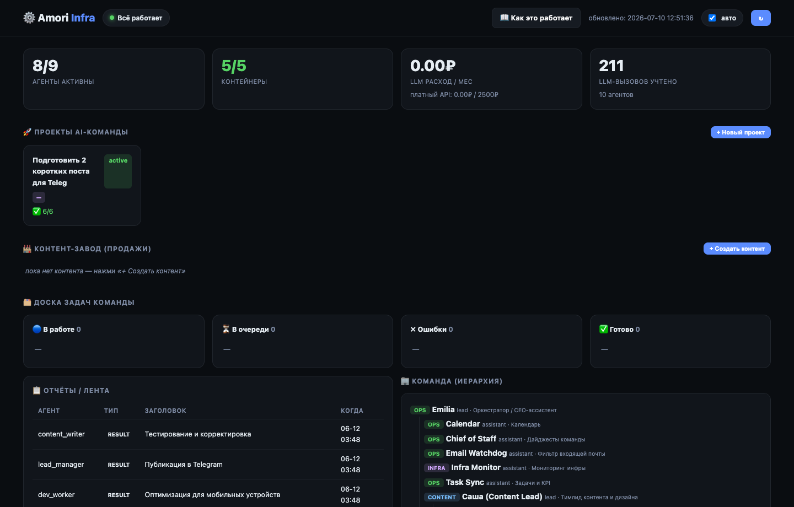
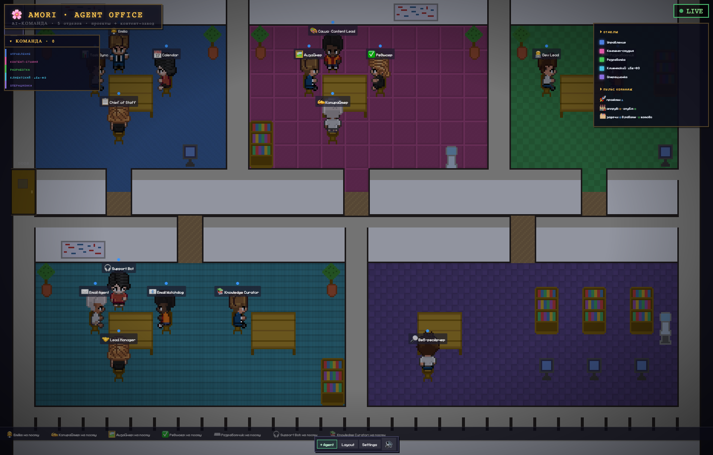
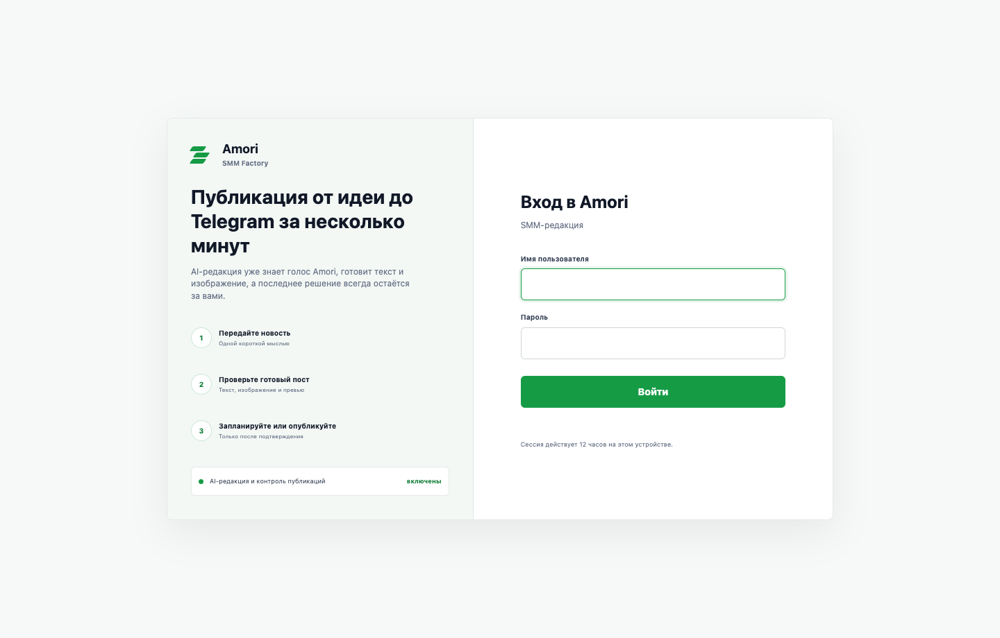
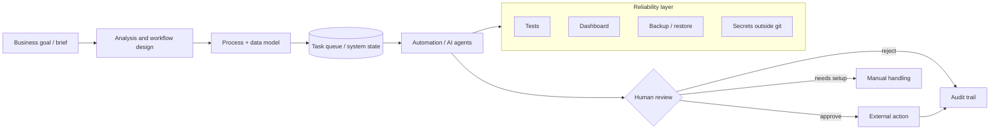
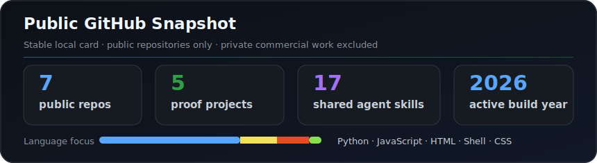
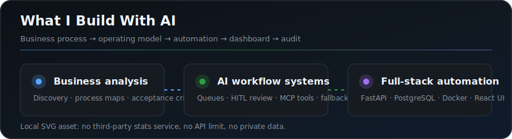

# Denis Kolesnikov / Lenis45

**Business/System Analyst · Automation Engineer · AI Product Systems Builder**

---

## Employer Snapshot

<table>
  <tr>
    <td width="50%">
      <h3>Positioning</h3>
      

        I combine business analysis, systems thinking, and hands-on engineering.
        I map messy workflows, define the operating model, and build the tools that make the process repeatable.
      

    </td>
    <td width="50%">
      <h3>Open To</h3>
      

        
        
        
        
      

    </td>
  </tr>
  <tr>
    <td width="50%">
      <h3>Current Product Context</h3>
      

        I am building <b>Amori</b>, a pet-tech GPS collar product, plus a local AI operating system
        that supports founder operations, SMM, support, CRM, and knowledge workflows.
      

    </td>
    <td width="50%">
      <h3>Engineering Standard</h3>
      

        I avoid one-off demos. My work emphasizes tests, dashboards, stateful queues, audit trails,
        safe failure modes, backups, and human approval for irreversible actions.
      

    </td>
  </tr>
</table>

---

## What I Solve

| Business problem | How I approach it |
|---|---|
| Process chaos and undocumented operations | Discovery, process maps, role boundaries, system diagrams, acceptance criteria |
| Manual SMM/content production | Brief-to-post workflow, brand rules, visual generation, review, scheduling, HITL publishing |
| Weak internal tooling | Dashboards, queues, operational states, alerts, audit trails |
| Fragmented CRM/support/email/calendar flows | Integration points, safe automation, local data boundaries, retry/recovery logic |
| AI outputs that cannot be trusted | Guardrails, deterministic checks, approval gates, and proof of external actions |

## How I Work

---

## UI Proof

<table>
  <tr>
    <td width="33%">
      
      <b>agent-os dashboard</b> 
      Local operating panel: agents, task queue, reports, budget, and system state.
    </td>
    <td width="33%">
      
      <b>Pixel office</b> 
      Visual team map for agent roles, departments, and operational activity.
    </td>
    <td width="33%">
      
      <b>Amori SMM Factory</b> 
      Product interface for turning a brief into reviewed Telegram-ready content.
    </td>
  </tr>
</table>

All screenshots are public-safe: no tokens, private messages, customer records,
channel IDs, or provider credentials are shown.

---

## Case Study Cards

<table>
  <tr>
    <td width="33%">
      <h3><a href="https://github.com/Lenis45/agent-os">agent-os</a></h3>
      

        Local AI operating system for Amori: role-based agents, PostgreSQL task queue,
        dashboard, Telegram operator UI, MCP bridge, backups, restore checks, and safety contracts.
      

      

        
        
        
      

    </td>
    <td width="33%">
      <h3><a href="https://github.com/Lenis45/amori-smm-platform">Amori SMM automation</a></h3>
      

        Public architecture and product overview for SMM automation: brief, branded copy,
        visual, editorial review, scheduling, approval, and Telegram delivery.
      

      

        
        
        
      

    </td>
    <td width="33%">
      <h3>Business automation mindset</h3>
      

        I model business operations as systems: process, data, roles, permissions,
        dashboards, failure states, and measurable handoff between human and automation.
      

      

        
        
        
      

    </td>
  </tr>
</table>

---

## Selected Public Work

| Project | What to evaluate |
|---|---|
| [agent-os](https://github.com/Lenis45/agent-os) | AI operating system architecture, runtime docs, tests, dashboard, MCP bridge |
| [amori-smm-platform](https://github.com/Lenis45/amori-smm-platform) | Product thinking and architecture for SMM automation |
| [lenis45.github.io](https://github.com/Lenis45/lenis45.github.io) | Portfolio and public-facing product presentation |
| [online-store](https://github.com/Lenis45/online-store) | Full-stack fundamentals: React, Node/Express, PostgreSQL |
| [3d_portfolio](https://github.com/Lenis45/3d_portfolio) | Interactive UI, React, Three.js, visual presentation |

Commercial Amori implementation work remains private. Public repositories show
architecture, implementation patterns, and product reasoning without exposing
source that belongs to the commercial product.

---

## System Design Example

The model call is not the product. The product is the operating layer around it:
state, permissions, review, observability, recovery, and a UI that people can use.

---

## Skills Matrix

| Category | Strengths |
|---|---|
| Business/system analysis | Discovery, requirements, process mapping, data flows, system diagrams, acceptance criteria |
| Automation | AI-assisted workflows, queues, scheduling, dashboards, alerts, support/CRM/content operations |
| AI systems | Agent workflows, prompt contracts, model fallback, tool use, MCP, HITL, audit |
| Backend | Python, FastAPI, PostgreSQL, service boundaries, diagnostics, reliability patterns |
| Frontend/product UI | React, TypeScript, responsive dashboards, Three.js experiments, operator UX |
| Operations/security | Docker Compose, macOS launchd, backups, restore tests, no secrets in git, fail-closed behavior |

---

## Contact

<b>Telegram:</b> <a href="https://t.me/deni_kol">@deni_kol</a>

---

## Activity And Graphs

Public graphs show only open GitHub activity. Private commercial Amori work is
represented through public architecture notes and selected safe screenshots.
The summary cards below are local assets so the profile does not depend on
third-party stats limits.

 

 

