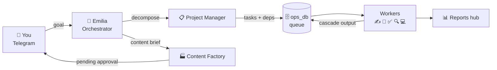

<div align="center">

[](https://git.io/typing-svg)

</div>

---

I design and build **autonomous AI agent systems** — teams of specialized agents that handle real operations end-to-end. My current system runs 9 Python agents on a Mac Mini, manages tasks via Telegram, and operates a commercial product around the clock without me.

```python
ROUTING = {
    "copywriting":  "copywriter",
    "design_brief": "designer",
    "code_task":    "dev",
    "research":     "researcher",
    "review":       "reviewer",
}

# Tasks flow through a recursive CTE — each worker
# receives the full output chain of its dependencies.
# No context gaps between dependent steps.
```

---

### What I'm building

```
agent-os/
├── agents/            9 Python agents running under launchd
│   ├── emilia.py      Orchestrator — takes goals on Telegram, spawns projects
│   ├── project_manager.py  Decomposes goals → tasks with deps into ops_db
│   ├── worker.py      Routes tasks → copywriter / designer / dev / researcher / reviewer
│   ├── content_factory.py  Brief → copy → image prompt → publish pipeline
│   └── ops/           Email watchdog · CRM · calendar · knowledge curator · monitor
│
├── mcp/               FastMCP stdio server — 11 tools for Claude Code / Codex
│   └── server.py      SQL read · task queue · content ops · agent config · reports
│
├── dashboard/         Ops control panel at :8099 — no framework, pure psycopg2
│   └── server.py      ThreadedConnectionPool: /api/state latency 5 s → 0.1 s
│
└── office-fork/       Pixel office at :5070 — React+Canvas, agents light up live
```

---

### How a goal becomes a shipped result



---

### Stack

**AI / agent layer**


**Product backend (commercial)**


---

### Stats

<div align="center">


</div>

<div align="center">

[](https://github.com/ryo-ma/github-profile-trophy)

</div>

<div align="center">

[](https://github.com/ashutosh00710/github-readme-activity-graph)

</div>

---

<div align="center">

[](https://github.com/Lenis45/agent-os)

</div>

<div align="center">


</div>
