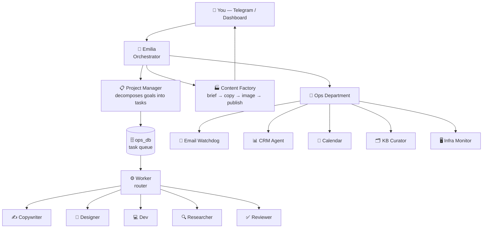
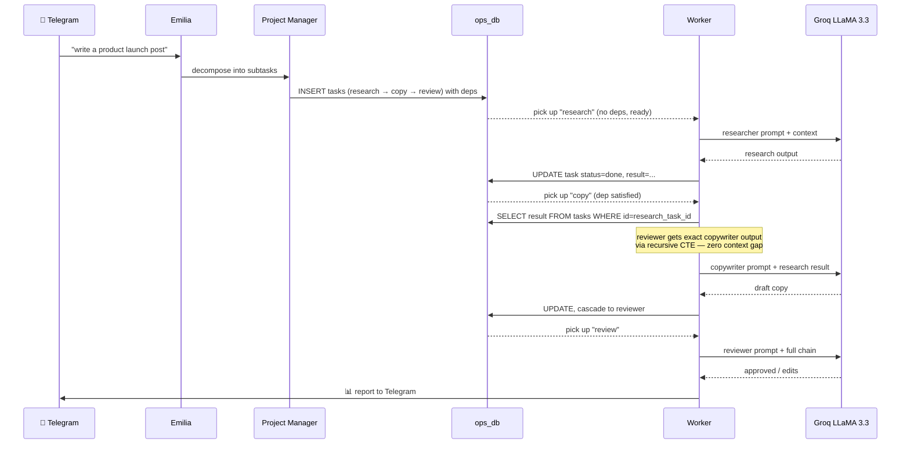
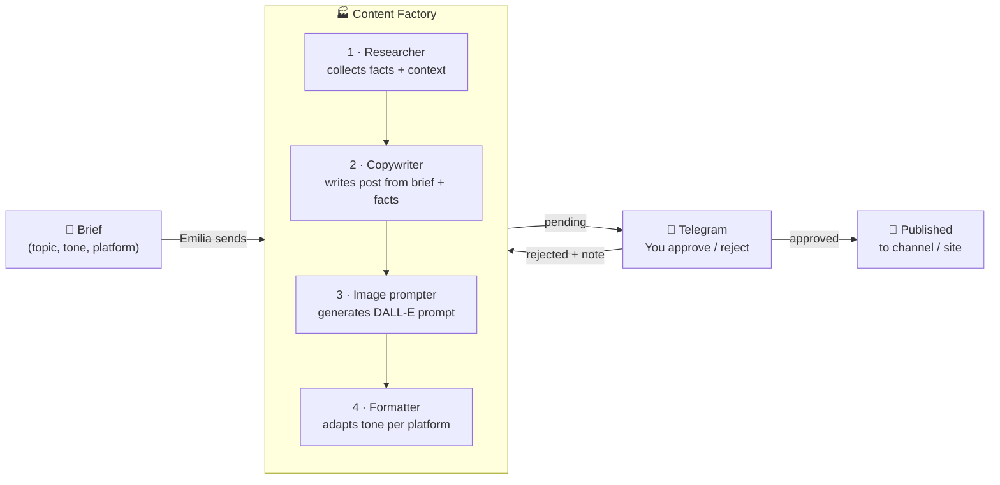

<div align="center">

[](https://git.io/typing-svg)

</div>

---

I design and run **autonomous AI agent systems** — teams of specialized agents that handle real operations without supervision. My current system manages a commercial product around the clock: it reads email, plans content, writes copy, coordinates tasks, syncs the CRM, and monitors infrastructure. I send a goal on Telegram. Agents do the rest.

That system is **[agent-os](https://github.com/Lenis45/agent-os)** — open source.

<div align="center">


</div>

<div align="center">


</div>

---

### Agent hierarchy



---

### How a task moves through the system



---

### Context passing between agents — recursive CTE

Each worker fetches not just its own task but the complete output chain of all upstream dependencies. The reviewer gets the exact text the copywriter produced — no summaries, no lost context.

```sql
-- agents/db.py — fetch_task_with_context()
WITH RECURSIVE dep_chain AS (
    SELECT t.id, t.task_type, t.result, t.depends_on
    FROM tasks t
    WHERE t.id = %(task_id)s

    UNION ALL

    SELECT t.id, t.task_type, t.result, t.depends_on
    FROM tasks t
    JOIN dep_chain d ON t.id = d.depends_on
)
SELECT task_type, result
FROM dep_chain
ORDER BY id;
```

---

### Content factory pipeline



---

### MCP server — 11 tools for Claude Code / Codex

```python
# mcp/server.py — FastMCP stdio transport
# Claude Code connects: claude mcp add agent-os -- python mcp/server.py

@mcp.tool()
def sql_read(query: str, db: str) -> list[dict]:
    """SELECT-only. Whitelisted DBs: ops_db, customer_db. No DDL."""

@mcp.tool()
def list_tasks(status: str = "running") -> list[dict]:
    """running / queued / failed / done — full task board"""

@mcp.tool()
def list_projects() -> list[dict]: ...
def project_status(project_id: int) -> dict: ...
def recent_reports(limit: int = 10) -> list[dict]: ...
def system_status() -> dict: ...          # agent heartbeats + PIDs

def list_content(status: str) -> list[dict]: ...   # content pipeline
def create_content(brief: str) -> dict: ...
def approve_content(content_id: int) -> dict: ...
def reject_content(content_id: int, note: str) -> dict: ...

def new_project(goal: str, context: str) -> dict: ...
```

---

### Infrastructure — Mac Mini, always on

```
Mac Mini (Apple M-series, 16 GB)
│
├── launchd (11 jobs, KeepAlive=true)
│   ├── ai.emilia            Orchestrator — polls Telegram every 30 s
│   ├── ai.project_manager   Picks up new projects from ops_db
│   ├── ai.worker            Processes task queue, 4 parallel slots
│   ├── ai.content_factory   Brief → publish pipeline
│   ├── ai.email_watchdog    IMAP idle on Gmail, classifies on arrival
│   ├── ai.crm_agent         Syncs contacts to Weeek every 10 min
│   ├── ai.calendar_agent    Reads/writes Google Calendar
│   ├── ai.kb_curator        Obsidian vault — tags, links, dedup
│   ├── ai.infra_monitor     HTTP pings + B2 backup check every 5 min
│   ├── ai.dashboard         Ops panel :8099 (psycopg2 pool)
│   └── ai.office            Pixel office :5070 (React + Canvas)
│
├── PostgreSQL 16
│   ├── ops_db               tasks, projects, reports, agent_config, content
│   └── customer_db          users, leads, CRM data
│
├── Qdrant
│   ├── project_knowledge    long-term memory per project
│   └── shared_memory        cross-agent context store
│
└── Redis                    task dedup, rate-limit counters, pub/sub
```

---

### LLM routing

```python
# agents/llm.py — model is chosen per task type, not per agent
TASK_MODEL_MAP = {
    "research":     "llama-3.3-70b-versatile",   # Groq — speed + depth
    "copywriting":  "llama-3.3-70b-versatile",   # Groq
    "code_task":    "qwen2.5-coder:32b",          # Ollama local — code
    "design_brief": "gemma3:27b",                 # Ollama local — creative
    "review":       "llama-3.3-70b-versatile",   # Groq
    "ops":          "llama-3.3-70b-versatile",   # Groq
}

# Cost guard — cuts off paid API calls if monthly budget exceeded
if paid_calls_this_month >= BUDGET_LIMIT:
    model = OLLAMA_FALLBACK  # falls back to local GPU node
```

---

### Stack

**AI / Agent layer**


**Product backend (commercial · private)**


---

### Stats

<div align="center">


</div>

<div align="center">


</div>

<div align="center">

[](https://github.com/ryo-ma/github-profile-trophy)

</div>

<div align="center">

[](https://github.com/ashutosh00710/github-readme-activity-graph)

</div>

---

### Featured

<div align="center">

[](https://github.com/Lenis45/agent-os)
[](https://github.com/Lenis45/online-store)

</div>

<div align="center">

[](https://github.com/Lenis45/3d_portfolio)
[](https://github.com/Lenis45/lenis45.github.io)

</div>
