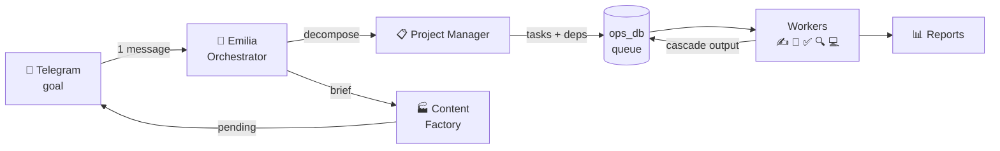

<div align="center">

[](https://git.io/typing-svg)

</div>

---

My startup runs on a team of 9 Python agents I built from scratch. I send a goal on Telegram — they decompose it into tasks, route each one to a specialist (copywriter, designer, dev, researcher, reviewer), pass results between dependents via recursive CTE, and report back. I approve what ships. The rest runs on its own, 24/7, on a Mac Mini next to my desk.

That system is **[agent-os](https://github.com/Lenis45/agent-os)** — fully open source.

<div align="center">


</div>

---

### How it works

```python
# Every task carries its full dependency chain —
# the reviewer gets the copywriter's exact output,
# not a summary. No context gaps between agents.

ROUTING = {
    "copywriting":  "copywriter",
    "design_brief": "designer",
    "code_task":    "dev",
    "research":     "researcher",
    "review":       "reviewer",
}
```



---

### System map

```
agent-os/
├── agents/
│   ├── emilia.py              Orchestrator — receives goals, owns the big picture
│   ├── project_manager.py     Breaks goals into tasks with explicit dependencies
│   ├── worker.py              Routes tasks; runs copywriter / designer / dev / researcher / reviewer
│   ├── content_factory.py     Brief → copy → image prompt → Telegram pending approval
│   └── ops/
│       ├── email_watchdog.py  Reads Gmail, classifies, drafts replies, logs to CRM
│       ├── crm_agent.py       Syncs leads and contacts to Weeek
│       ├── calendar_agent.py  Manages schedule from natural-language instructions
│       ├── kb_curator.py      Keeps Obsidian knowledge base tidy and cross-linked
│       └── infra_monitor.py   Pings services, checks B2 backups, alerts on anomalies
│
├── mcp/server.py              FastMCP stdio — 11 tools for Claude Code / Codex / Hermes
├── dashboard/server.py        Ops panel :8099 — psycopg2 pool, /api/state in ~0.1 s
└── office-fork/               Pixel office :5070 — agents light up in real time
```

---

### Stack

**Agent layer**


**Product backend (commercial, private)**


---

### Stats

<div align="center">


</div>

<div align="center">


</div>

<div align="center">

[](https://github.com/ryo-ma/github-profile-trophy)

</div>

<div align="center">

[](https://github.com/ashutosh00710/github-readme-activity-graph)

</div>

---

### Featured

<div align="center">

[](https://github.com/Lenis45/agent-os)

</div>

---

<div align="center">


</div>
