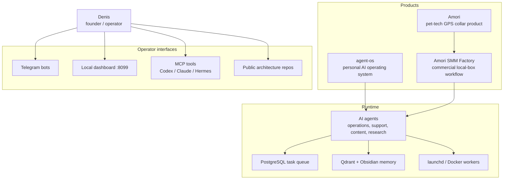
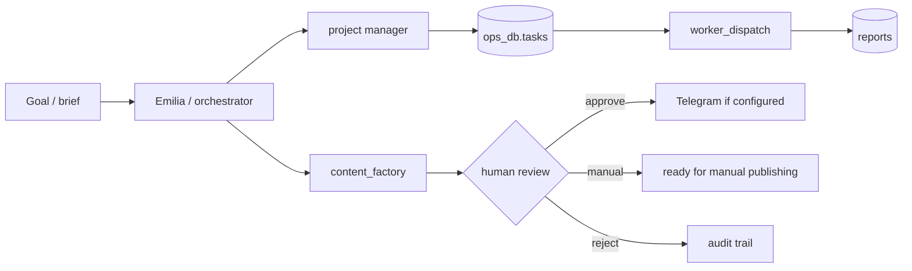
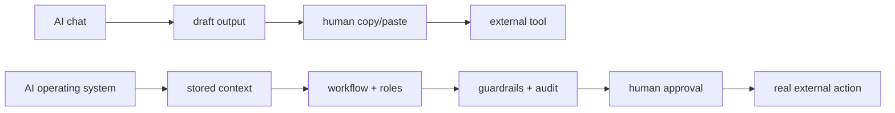

# Denis Kolesnikov / Lenis45

**Founder-operator building Amori and local AI operating systems for real work**

---

## What I Build

I build practical AI infrastructure around a real startup, not isolated demos.
My main product context is **Amori**: a pet-tech project around GPS collars for
pet owners. Around that business I am building:

| Area | What it means in practice |
|---|---|
| **AI operating systems** | Local agent teams, task queues, dashboards, audits, backups, MCP tools |
| **SMM automation** | Brief -> branded copy -> visual -> editorial review -> scheduled/approved Telegram delivery |
| **Founder operations** | Email triage, calendar support, CRM/lead flows, knowledge capture, reports |
| **Commercial product engineering** | Private Amori product and SMM automation code, with public architecture overviews |
| **Frontend/product UX** | Operator dashboards, 3D/interactive portfolio work, React/TypeScript interfaces |

The core principle is simple:

> AI prepares, checks, routes, and drafts. A human approves irreversible public
> actions such as publishing, customer communication, and external changes.

---

## Current System Map

---

## Featured Repositories

### [agent-os](https://github.com/Lenis45/agent-os)

Public repository for my local Amori AI operating system.

What is real today:

- macOS `launchd` + Docker Compose runtime
- PostgreSQL 16, Qdrant, Redis, Langfuse, n8n
- Telegram operator bots and local dashboard
- MCP bridge for Codex / Claude / Hermes
- agent tests: `90 passed`
- Groq default moved away from deprecated Llama 3.3 to `openai/gpt-oss-120b`
- human-in-the-loop content pipeline: `pending -> approved/ready/published/rejected`

### [amori-smm-platform](https://github.com/Lenis45/amori-smm-platform)

Public product and architecture overview for the Amori SMM automation platform.
The commercial implementation lives in a private repository, while this repo
explains the product direction, local-box architecture, UX, and operating model.

The product goal is not "another AI chat". It is a workflow for SMM specialists
and marketers who need to prepare publishable content quickly without rebuilding
prompts, brand rules, visual briefs, approvals, and scheduling by hand.

### Private Amori Product Work

Some work is intentionally private because it is commercial product code:

- Amori product platform and product experiments
- Amori SMM Factory implementation
- private backups and local operational data
- credentials, provider env, Telegram destinations, customer/support data

Public repositories show architecture and selected implementation patterns.
Private repositories hold commercial source, credentials are kept outside git.

### [lenis45.github.io](https://github.com/Lenis45/lenis45.github.io)

Personal portfolio site.

### [ai-devkit](https://github.com/Lenis45/ai-devkit)

Small public AI/dev tooling experiments.

### [online-store](https://github.com/Lenis45/online-store)

Full-stack store project: React frontend, Node/Express backend, PostgreSQL.

### [3d_portfolio](https://github.com/Lenis45/3d_portfolio)

Interactive 3D developer portfolio built with React and Three.js.

---

## How I Think About AI Products

The valuable part is usually not the text generation itself. The value is the
system around generation:

- persistent context and brand rules
- repeatable workflows
- role separation
- audit trails
- safe failure states
- backups and restore checks
- visible system health
- clear public/private boundaries

---

## Technical Focus

| Layer | Tools and patterns I use |
|---|---|
| AI runtime | Groq GPT OSS 120B, DeepSeek V4 Flash, Ollama/local fallbacks, deterministic guards |
| Agent systems | Python, MCP, A2A-style JSON-RPC, queues, role-based workers, HITL |
| Data | PostgreSQL, row-level boundaries, Qdrant vector memory, Obsidian notes |
| Ops | Docker Compose, macOS launchd, backups, restore tests, support bundles |
| Product UI | FastAPI, dependency-light HTML/CSS/JS, React, TypeScript, Three.js |
| Commercial safety | private repos, untracked env, redacted diagnostics, no secrets in public docs |

---

## Current Priorities

| Priority | Work |
|---|---|
| P0 | Keep the Amori AI infrastructure truthful, testable, and recoverable |
| P0 | Build the first usable SMM automation department for Amori |
| P1 | Improve product UX for marketers: calendar, editorial studio, visual assets, automations |
| P1 | Keep public GitHub docs aligned with real system behavior |
| P2 | Turn more private product learnings into safe public architecture notes |

---

## Public Activity

---

## Contact / Identity

- GitHub: [Lenis45](https://github.com/Lenis45)
- Portfolio: [lenis45.github.io](https://lenis45.github.io)
- Main public systems to review: [agent-os](https://github.com/Lenis45/agent-os), [amori-smm-platform](https://github.com/Lenis45/amori-smm-platform)
